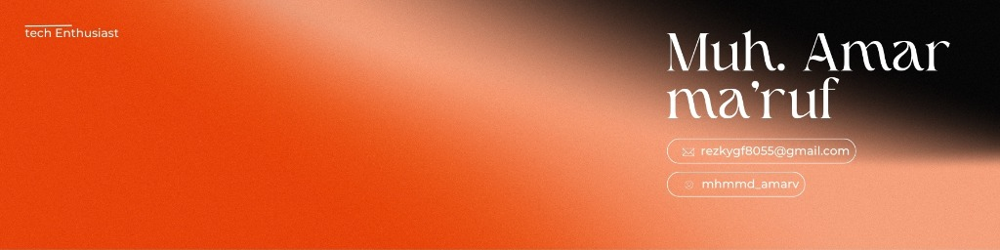

  

  

  

 

  
  &nbsp;&nbsp;
  
  &nbsp;&nbsp;
  

---

## 📈 Activity Graph

  

---

## 🐍 Contribution Snake

<picture>
  <source media="(prefers-color-scheme: dark)" srcset="https://raw.githubusercontent.com/Marvx-US/Marvx-US/output/snake-dark.svg">
  
</picture>

---

## 🛠️ Tech Stack

### 🎨 Frontend

  

### ⚙️ Backend

  

### 🗄️ Database

  

### 🔧 Tools & DevOps

  

---

## 🚀 Featured Projects

  

---

## 💬 Random Dev Quote

  

---

  

  

    
  

  

